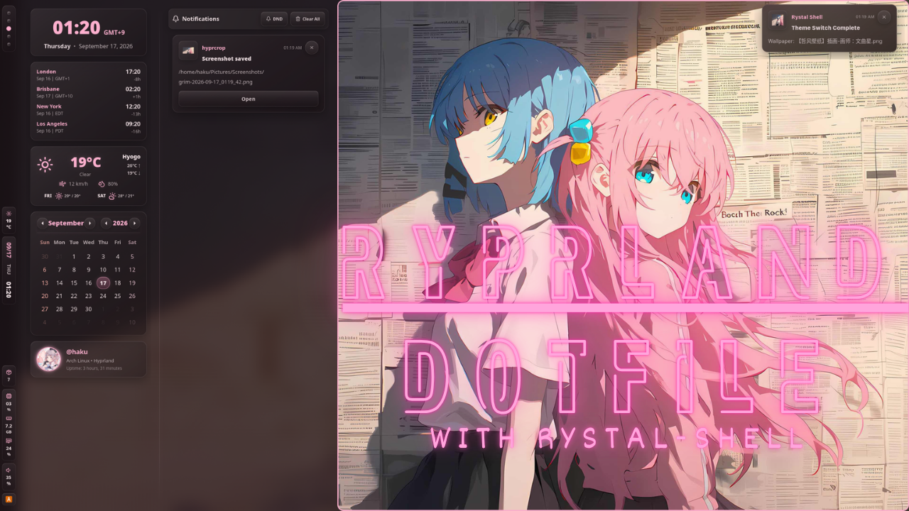

# Ryprland-dotfile



This repository is my personal configuration files with [Hyprland](https://hypr.land), a dynamic tiling Wayland compositor.
This configurations are heavily based on [Matuprland](https://github.com/Abhra00/Matuprland).
I think Matuprland is a great dotfile, but I want to make it use my own style and preferences, so I forked it and made several changes.

> [!IMPORTANT]
> I'll try to keep it up to date with the latest changes in Hyprland, but I won't be able to provide support for it.
> Before copying, modifying, or redistributing any part of this repository,
> review the [Licensing](#licensing) section. Public availability does not mean
> that every included file is offered under the same reuse terms.

## How to use

> [!WARNING]
> You need to have a backup of your current configuration files before using this repository, because it will overwrite your current configuration files.
> And also, you need to have [GNU Stow](https://www.gnu.org/software/stow/) installed to use this repository.

1. Clone the repository to your local machine.

```bash
git clone https://github.com/ry2x/Ryprland-dot
cd ./Ryprland-dot
```

2. Stow the configuration files to your home directory.

```bash
stow ./base

#optional
stow ./nvim-yazi # For neovim and yazi
```

3. Re-login to apply the changes.

4. Enjoy your new Hyprland configuration!

## Directory structure

- `base/`: Contains the base configuration files that are common for both desktop and laptop.
- `nvim-yazi/`: Contains the configuration files for neovim and yazi.
- `private-dotfile/`: Not publicly available, contains my private information.
- `README.md`: This file.

## Requirements

Install these packages before using this dotfile setup: [applist](./applist.md)

> [!NOTE]
> A separate README is available for the AGS configuration.
> You can access it here: [AGS README](./base/.config/ags/README.md)

### Fonts

- GTK: SF Pro Regular 11
- Qt: Noto Sans CJK JP 12
- Coding: Fira Code Regular 12

## 日本語入力とmozc辞書について

このセットアップでは、fcitx5 + mozc で日本語入力を行います。
辞書は、fcitx5-mozc-ext-neologd または fcitx5-mozc-ut の利用をおすすめします。
fcitx5-mozc-ut を使う場合は、先に mozc-ut をインストールしてから fcitx5-mozc-ut をインストールしてください。

多くの人は fcitx5 <-> mozc の切り替えで入力していると思いますが、私は mozc(Direct) <-> mozc(Hiragana) の切り替えで運用しています。
設定方法は [Zennの記事](https://zenn.dev/ry2x/scraps/451ecfdc0a5c07) にまとめています。

## Licensing

This repository does not currently have a single project-wide license.

It contains original configuration, files derived from third-party dotfile
projects, separately licensed scripts and assets, and Git submodules. Files
that include their own copyright or license notices remain subject to those
terms. Submodules are governed by the licenses of their respective
repositories.

Rystal-shell is licensed separately under GPL-3.0-or-later.

Original zsh configuration files carrying an SPDX license header are licensed
under GPL-3.0-or-later. See
[`LICENSES/Ryprland-zsh-GPL-3.0-or-later.txt`](LICENSES/Ryprland-zsh-GPL-3.0-or-later.txt).

Independently implemented shell scripts carrying a Ry2X SPDX notice are also
licensed under GPL-3.0-or-later. The GPL v3 text is available at
[`LICENSES/GPL-3.0.txt`](LICENSES/GPL-3.0.txt).

The following independently authored configuration components are licensed by
Ry2X under GPL-3.0-or-later:

- `nvim-yazi/.config/nvim/`;
- `base/.config/hypr/hyprland.lua` and Lua files under
  `base/.config/hypr/modules/`;
- Rasi files under `base/.config/rofi/`.

Generated files, Git submodules, third-party scripts and assets within or next
to these paths retain their separately documented status.

Unless a license is explicitly stated for a file or component, no additional
permission is granted to copy, modify, or redistribute it. See
[Third-Party Notices](THIRD_PARTY_NOTICES.md) and the
[license audit](LICENSE_AUDIT.md) for details.
